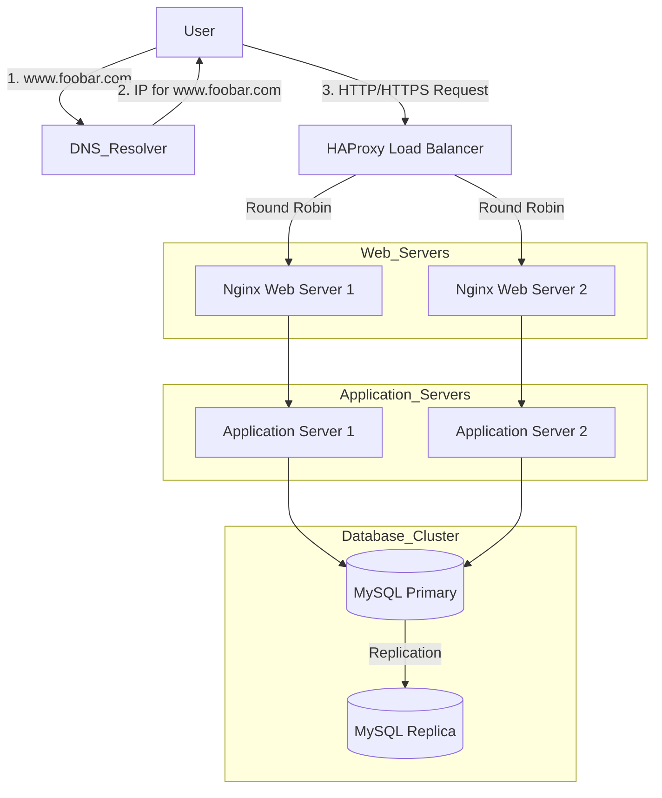

# Distributed Web Infrastructure 🏗️

This document outlines the design of a distributed web infrastructure with three servers.

## Diagram 📊

## Infrastructure Components Explanation 📝

### Additional Components and Their Purpose

1. **Load Balancer (HAProxy)** ⚖️
   * **Why Added**: To distribute incoming traffic across multiple web servers, improving availability and performance.
   * **Distribution Algorithm**: Round Robin
     * How it works: Requests are distributed sequentially to each server in the pool, ensuring equal distribution of load.
   * **Active-Active vs Active-Passive**:
     * **Active-Active**: All servers are actively handling requests simultaneously. In our setup, both web servers are actively serving traffic.
     * **Active-Passive**: One server handles all traffic while the other remains idle until the primary fails. Not used in our current setup.

2. **Multiple Web Servers** 🌐
   * **Why Added**: To eliminate the single point of failure and handle increased traffic load.
   * Each server runs Nginx and can serve requests independently.

3. **Multiple Application Servers** 👨‍💻
   * **Why Added**: To distribute application processing load and provide redundancy.
   * Each server can handle application logic independently.

4. **Database Primary-Replica Cluster** 💾
   * **How it works**: 
     * The Primary node handles all write operations and some read operations
     * The Replica node handles read operations and serves as a backup
     * Changes on the Primary are automatically replicated to the Replica
   * **Primary vs Replica**:
     * **Primary Node**: Handles all write operations (INSERT, UPDATE, DELETE) and critical read operations
     * **Replica Node**: Handles read operations (SELECT) and serves as a backup in case of Primary failure

## Issues with this Infrastructure ⚠️

### Single Points of Failure (SPOF) 💔
1. **Load Balancer**: If the load balancer fails, the entire system becomes inaccessible
2. **Database Primary**: If the primary database fails, write operations are affected until failover
3. **Network**: Single network connection to the load balancer

### Security Issues 🔒
1. **No Firewall**: The infrastructure lacks a firewall to protect against unauthorized access
2. **No HTTPS**: Communication is not encrypted, making it vulnerable to man-in-the-middle attacks
3. **No SSL/TLS**: No secure communication between components

### Monitoring Issues 📊
1. **No Monitoring System**: 
   * Can't track server performance
   * Can't detect failures automatically
   * Can't monitor resource usage
   * Can't track application metrics

### Additional Concerns
1. **No Backup System**: No automated backup solution for data
2. **No Disaster Recovery Plan**: No defined process for system recovery
3. **Limited Scalability**: While better than a single server, the system still has limitations in terms of horizontal scaling

This distributed infrastructure provides better availability and performance than a single-server setup, but still requires additional components for a production-ready environment. 
