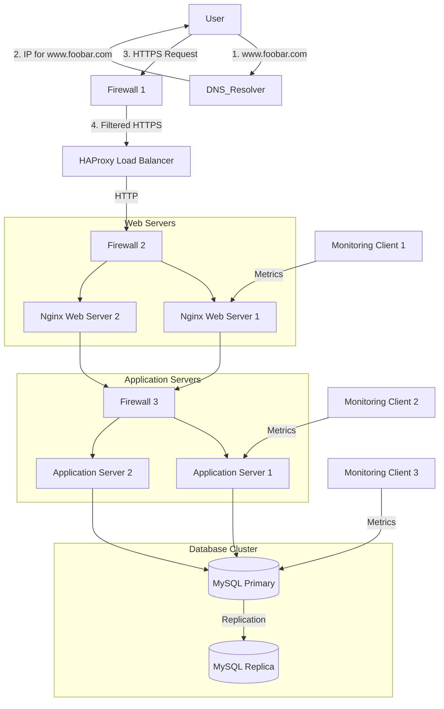

# Secured and Monitored Web Infrastructure 🏗️

This document outlines the design of a secured and monitored web infrastructure with three servers.

## Diagram 📊

## Infrastructure Components Explanation 📝

### Additional Security Components

1. **Firewalls** 🛡️
   * **Why Added**: To protect the infrastructure from unauthorized access and potential attacks
   * **Purpose**:
     * Control incoming and outgoing network traffic
     * Block malicious requests
     * Implement security policies
     * Protect against DDoS attacks
   * **Three Firewall Layers**:
     * Firewall 1: Protects the entire infrastructure
     * Firewall 2: Protects web servers
     * Firewall 3: Protects application servers

2. **SSL Certificate** 🔒
   * **Why Added**: To enable HTTPS and secure data transmission
   * **Purpose**:
     * Encrypt data in transit
     * Verify server identity
     * Protect against man-in-the-middle attacks
     * Ensure data integrity

3. **Monitoring Clients** 📊
   * **Why Added**: To collect and analyze system metrics
   * **Purpose**:
     * Track system performance
     * Detect issues early
     * Monitor resource usage
     * Collect application metrics
   * **Data Collection**:
     * Collects metrics from servers
     * Sends data to monitoring service (SumoLogic)
     * Enables real-time monitoring
     * Provides historical data analysis

### Monitoring Web Server QPS (Queries Per Second) 📈

To monitor web server QPS:
1. Configure monitoring client to collect Nginx access logs
2. Set up log parsing in monitoring service
3. Create custom metrics for request counting
4. Set up alerts for unusual QPS patterns
5. Create dashboards to visualize QPS trends

## Issues with this Infrastructure ⚠️

### SSL Termination at Load Balancer 🔐
* **Issues**:
  * Traffic between load balancer and servers is unencrypted
  * Potential security vulnerability in internal network
  * Need for additional SSL certificates for internal communication
  * Increased complexity in certificate management

### Single MySQL Write Server 💾
* **Issues**:
  * Single point of failure for write operations
  * Limited scalability for write operations
  * Potential performance bottlenecks
  * Risk of data loss if primary fails

### Identical Server Components 🔄
* **Issues**:
  * Resource contention between services
  * Difficulty in scaling individual components
  * Complex maintenance procedures
  * Higher resource requirements per server
  * Limited flexibility in resource allocation

### Additional Concerns
1. **Monitoring Coverage**:
   * Need for more comprehensive monitoring
   * Potential gaps in metric collection
   * Limited visibility into application performance

2. **Security Considerations**:
   * Need for regular security updates
   * Vulnerability scanning requirements
   * Access control management
   * Certificate renewal process

3. **Scalability Limitations**:
   * Vertical scaling constraints
   * Horizontal scaling complexity
   * Resource allocation challenges

This secured and monitored infrastructure provides better security and observability than the previous setup, but still has areas for improvement in terms of scalability and maintenance. 