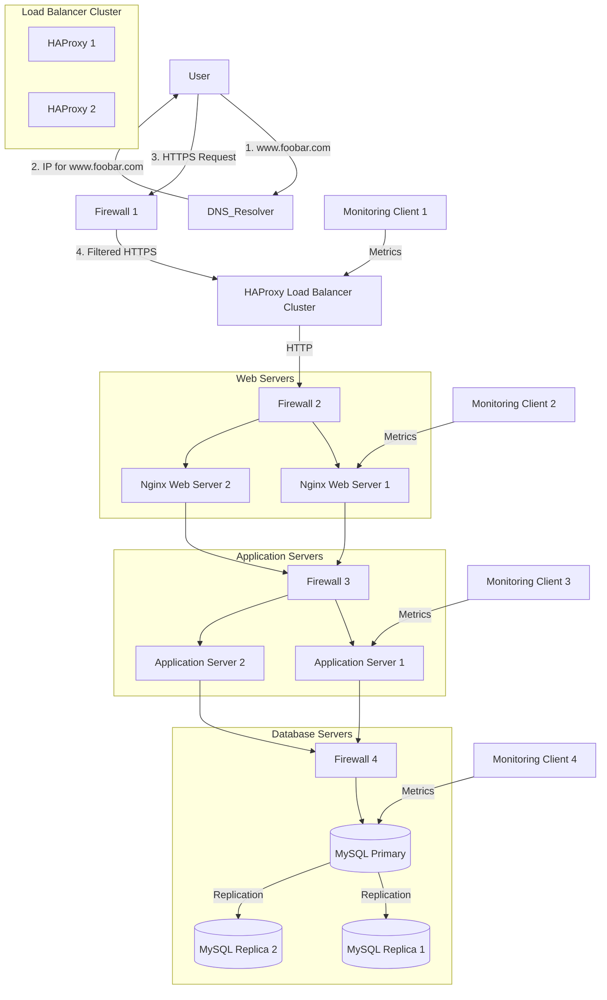

# Scaled Up Web Infrastructure 🏗️

This document outlines the design of a scaled-up web infrastructure with dedicated servers for each component.

## Diagram 📊

## Infrastructure Components Explanation 📝

### Additional Components and Their Purpose

1. **Load Balancer Cluster** ⚖️
   * **Why Added**: To eliminate the single point of failure in load balancing
   * **Benefits**:
     * High availability for load balancing
     * Automatic failover between load balancers
     * Increased capacity for handling traffic
     * Better distribution of incoming requests

2. **Dedicated Web Servers** 🌐
   * **Why Added**: To focus resources on serving static content
   * **Benefits**:
     * Optimized for static content delivery
     * Better caching capabilities
     * Improved performance for static assets
     * Easier scaling of web serving capacity

3. **Dedicated Application Servers** 👨‍💻
   * **Why Added**: To separate application logic from web serving
   * **Benefits**:
     * Focused resources on application processing
     * Better handling of dynamic content
     * Easier scaling of application capacity
     * Improved maintainability

4. **Dedicated Database Servers** 💾
   * **Why Added**: To optimize database performance and reliability
   * **Benefits**:
     * Dedicated resources for database operations
     * Better data management
     * Improved backup capabilities
     * Enhanced security isolation

### Application Server vs Web Server

1. **Web Server (Nginx)** 🌐
   * **Primary Functions**:
     * Serves static content (HTML, CSS, images)
     * Handles HTTP/HTTPS protocols
     * Manages SSL/TLS
     * Implements caching
     * Acts as reverse proxy
   * **Characteristics**:
     * Optimized for serving files
     * Handles high concurrent connections
     * Manages client connections
     * Implements security policies

2. **Application Server** 👨‍💻
   * **Primary Functions**:
     * Executes application code
     * Processes business logic
     * Manages application state
     * Handles database interactions
     * Generates dynamic content
   * **Characteristics**:
     * Optimized for processing
     * Manages application resources
     * Handles complex operations
     * Implements business rules

## Benefits of This Architecture 🎯

1. **Improved Scalability** 📈
   * Each component can be scaled independently
   * Better resource utilization
   * Easier capacity planning
   * More flexible scaling options

2. **Enhanced Reliability** 🛡️
   * Reduced single points of failure
   * Better fault isolation
   * Improved disaster recovery
   * Higher availability

3. **Better Performance** ⚡
   * Optimized resource allocation
   * Reduced resource contention
   * Improved response times
   * Better handling of different types of requests

4. **Easier Maintenance** 🔧
   * Isolated components
   * Simplified updates
   * Better troubleshooting
   * Reduced maintenance windows

This scaled-up infrastructure provides better performance, reliability, and maintainability than the previous setup, with dedicated resources for each component and improved high availability. 